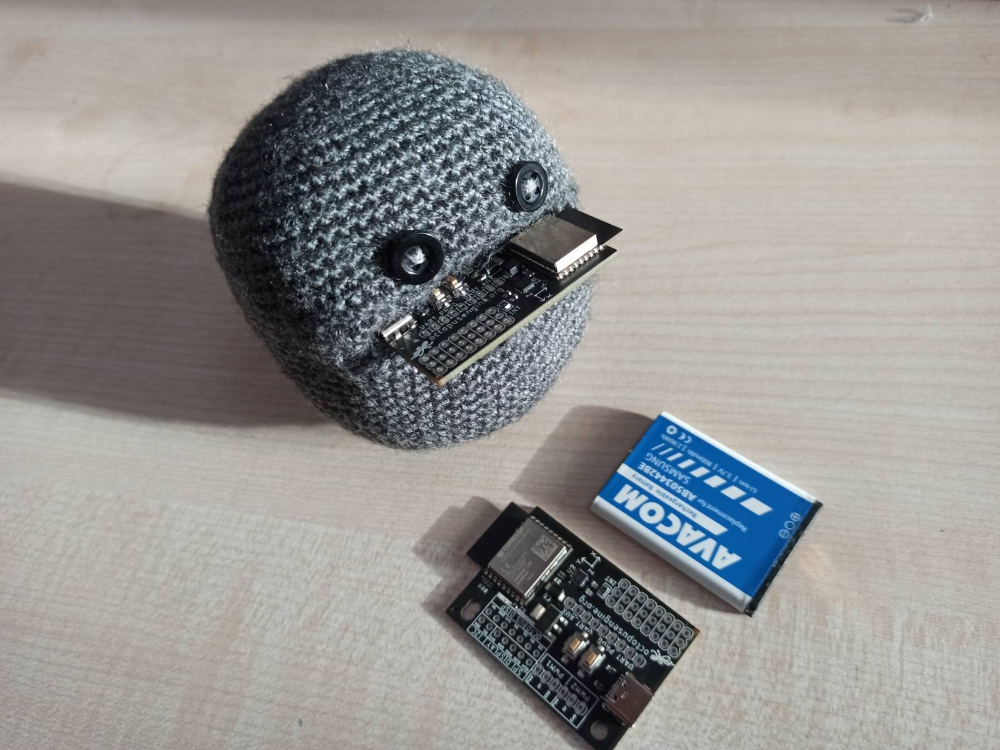
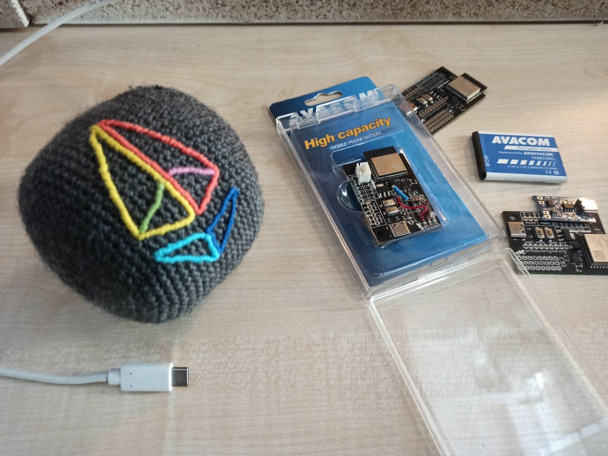
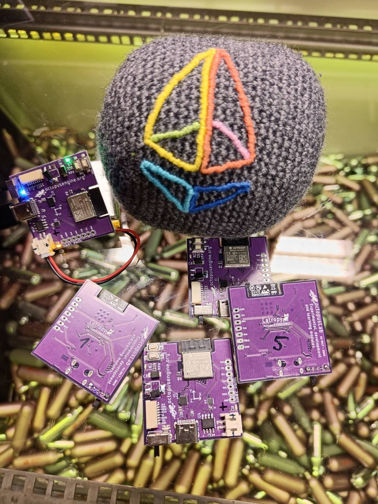

# Proof-of-Cat: Cat as an entropy generator

Proof-of-Cat is a novel A novel approach to generating randomness for cryptographic systems, utilizing the inherent unpredictability and entropy of domestic felines, also known as cats.

Read the [CatPaper](./proofofcat.pdf)

## Catropy

This reasearch was conducted as a contribution to [Ethereum KZG Ceremony](https://github.com/ethereum/kzg-ceremony). To participate in the ceremony, CRNG under the name _Catropy_ was built. 

Catropy, loosely specified in the Proof-of-Cat CatPaper, is a small devices dedicated to harvesting entropy from cats. Current design is a result of various iterations and consists of custom board with:
- ESP32 C2 with wifi, bluetooth 
- Sensors - gyroscope, accelerometer
- Li-ion battery and charging circuit 

To create a cat toy, it comes in hand made knitted ball which protects the electronics and provide soft experience. Check pictures below. 

