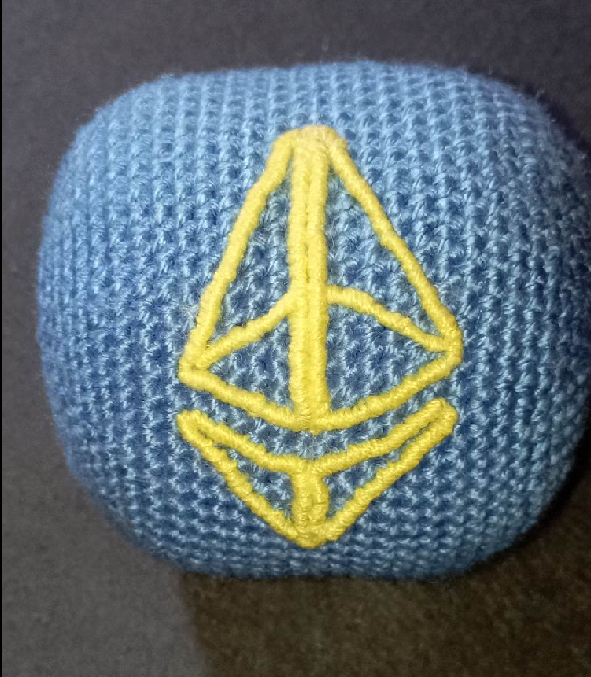
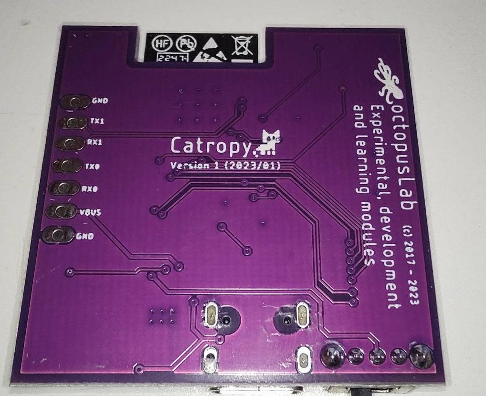

# Proof-of-Cat: Cat as an entropy generator

Proof-of-Cat is a novel approach to generating randomness for cryptographic systems, utilizing the inherent unpredictability and entropy of domestic felines, also known as cats.

Read the **[CatPaper](./proofofcat.pdf)** and check the **Catropy [docs](./docs.md)**. 

## Catropy

_Catropy_ is a CRNG (Cat Random Number Generator) designed as an implementation of Proof-of-Cat. Research and development of this device was intented for participation in [Ethereum KZG Ceremony](https://github.com/ethereum/kzg-ceremony) and supported by EF grant. 

It's a basically toy which can generate randomness from its movement. The circuit board is a microcontroller with wifi and battery which enables to use the device fully remotely. To learn more about hardware design and usage, look into the [documentation](./docs.md). 

The toy is not just a circuit board. It comes in hand-made knitted ball which protects the electronics and provides soft experience. It was demonstrated that it works well not just with cats, [but also core devs](https://twitter.com/liamihorne/status/1617974952413761536). Various versions and color combinations are available. Check example pictures below. 

Device can be used to contribute to the KZG Ceremony but it is not its sole purpose. The Catropy software enables you to use it for generating entropy for anything which needs it. But the device is general purpose and you can reprogram it to utilize the microctroller however you want. For example, another use case being developed is for using the device for medical diagnostic of patients based on tracking their movement and its changes. 

## Get a Catropy device

Catropy was designed as an open-source device with no profit incentives. You can build the device by yourself but if you would like purchase one, you can do it by donating to a [cat shelter in Catalonia](https://www.eljardinetdelsgats.org). Based on donation of minumum 0.02ETH, we will reward you with a fully featured Catropy toy. 

And if you are a member of Protocol Guild, the toy completely on us! 

### Donation

Donations are handled by us, converted to fiat and physically donated to [El Jardinet dels Gats](https://www.eljardinetdelsgats.org), a non-profit helping cats which was also involved testing the Catropy toy. In case we receive high number of donations (0.5ETH+), it will be split between Jardinet and another [local organization](https://www.degats.org/) with multiple colonies. The official donation address is catropy.eth (0x543cbBD2bf6f6eC71254E75b7FEAbb222B143343). All funds on this address will be donated to help with expenses in the shelter - food, materials, veterinary checks, treatement and vaccinations. 

### Shipping 

You can pickup Catropy personally during **EthZurich** conference or rest of the year in Prague, [Paralelní Polis](https://goo.gl/maps/rJfCFSxNbkSRXrLw9) or Barcelona. 

Otherwise we can ship it to your address. Just add shipping fee to your donation, you can use a [shipping estimate calculator](https://coolparcel.com/). (0.5kg package, shipping from Czech republic, 17001). Feel free to reach out if you are not sure, we can ship it first and let you know the exact cost. 

### How to

Step by step, this is how you get your device: 

- Donate minimum of 0.02ETH (around 30EUR) to catropy.eth or 0x543cbBD2bf6f6eC71254E75b7FEAbb222B143343. You can use mainnet, Arbitrum, Optimism, Polygon, Gnosis chain or Aztec (zk.money, address is @catropy). For donating over other chains, reach out to us. 
- Choose a color combination. Balls come in various colors, we prepared gray with colorful ETH logo, pink with white logo and blue with yellow. Check pictures below and more in [assets directory](https://github.com/taxmeifyoucan/proof-of-cat/tree/gh-pages/src/assets). If you wish your own color combination, feel free to write us but note it might take few extra days before shipping. 
- Send us an email to meow@proofof.cat with your shipping details (your address or pickup option), chosen color and sign it with the address you sent donation from. Signing message with a wallet is easy, you can use a tool like [MyCrypto](https://app.mycrypto.com/sign-message). If you are a Protocol Guild member, sign it using your address PG or just contact us to verify it's really you. 
- Embrace the chaos 

## Contact

For support, orders and any kind of questions, please contact us at meow@proofof.cat

 

