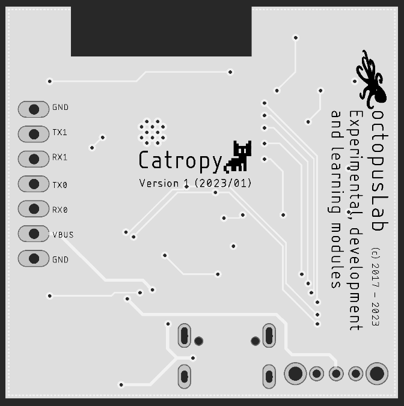
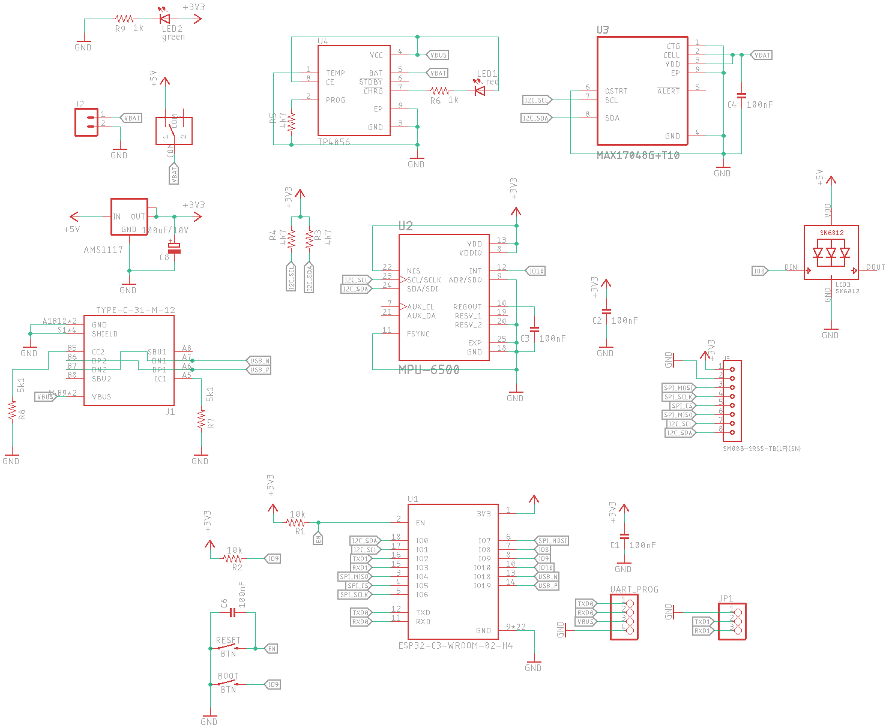
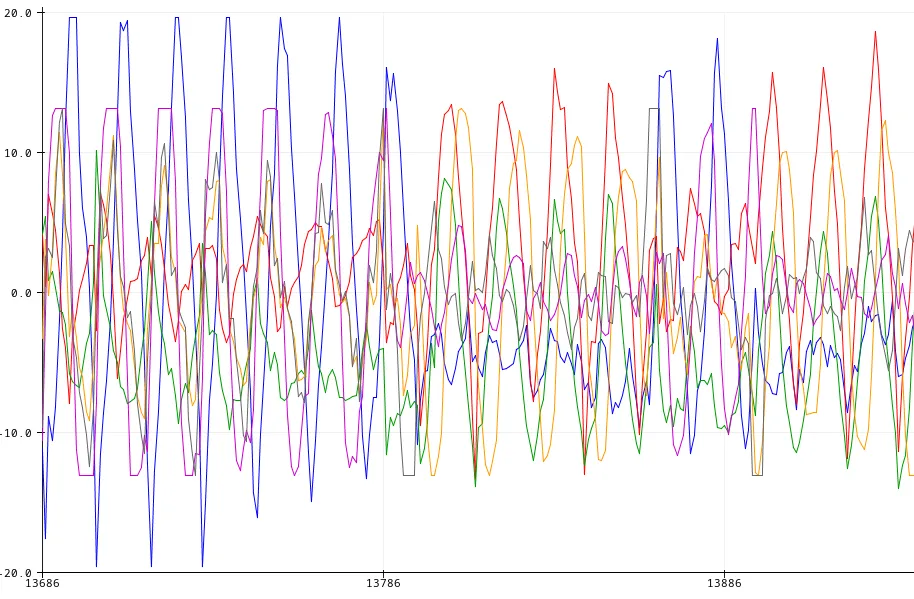

# Proof-of-Cat: Cat as an entropy generator

Proof-of-Cat is a novel approach to generating randomness for cryptographic systems, utilizing the inherent unpredictability and entropy of domestic felines, also known as cats.

Read the **[CatPaper](./proofofcat.pdf)**.

## Catropy

This reasearch was conducted as a contribution to [Ethereum KZG Ceremony](https://github.com/ethereum/kzg-ceremony). To participate in the ceremony, CRNG under the name _Catropy_ was built. 

Catropy, originally proposed in the Proof-of-Cat CatPaper, is a small device dedicated to harvesting entropy from cats. Current design is a result of various iterations and consists of a custom board with:
- ESP32 C2 with wifi, bluetooth, USB-C 
- Sensors for gathering data - gyroscope, accelerometer
- Lipo battery 500-800mAh and charging circuit 

Check the board scheme

  

The software is written in micropython and serves a simple API over local network to provide the randomness. Documentation and code improvements are coming soon, current version can be [found here](https://github.com/taxmeifyoucan/proof-of-cat/tree/master/esp). 

The board itself is not tje toy of course. It comes in hand-made knitted ball which protects the electronics and provide soft experience. It was demonstrated that it works well not just with cats, [but also core devs](https://twitter.com/liamihorne/status/1617974952413761536). Various color combinations and sizes are available. 

