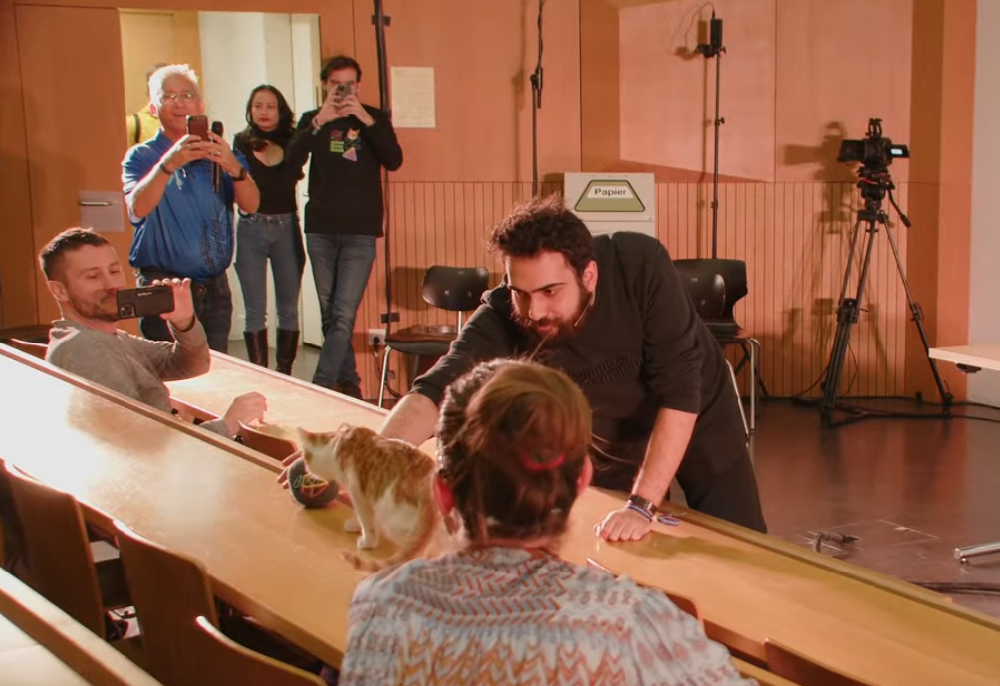
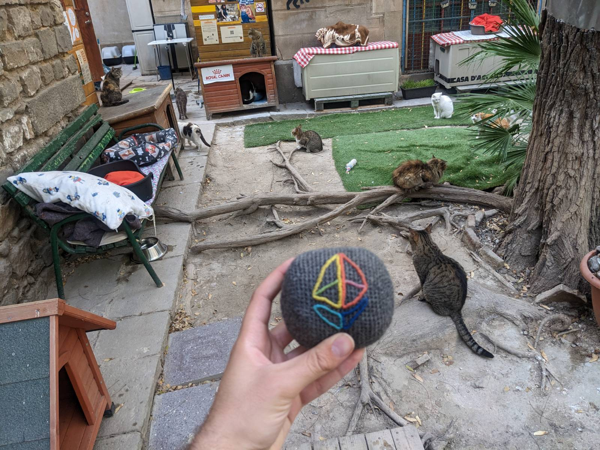

The story of Catropy contributions to Ethereum KZG Ceremony. 

## What is Catropy? 

Catropy is an implementation of [Proof-of-Cat](./proofofcat.pdf) mechanism for securing cryptography with randomness generated by cats. One could even call it a CRNG - Cat Random Number Generator. 

Research and development of the topic and a device suitable for secure entropy generation started around 10/2022 as [Ethereum KZG ceremony](https://github.com/ethereum/kzg-ceremony) was slowly approaching. Since the proof of concept, the device design has been revisited in 3 iterations. The result is a dedicated custom board with ESP32 C3 microcontroller which uses gyroscope and accelerometer to gather entropy from its movement. When the collected entropy reaches a predetermined size, it acts as a server providing an API endpoint with a randomness beacon. Provided randomness is result of sampling 6 axis movement in uniform random periods and passing them through chaos functions. Hardware and software is open, find all details in Catropy [docs](./docs.md). 

Though the initial goal was to use the device for ceremony contributions, it's important to note that the device is multipurpose and can be used for more than that. The created entropy can be used for any kind of randomness, e.g. to generate directly private keys for crypto wallets. But apart from its entropy use case, small device with general computation capabilities and movement sensors is useful in various fields. For example, we have collaborated with a doctor who is experimenting with using it in neurological diagnostics. The patient wears the device on his hand and is given specific movement and cognitive task. By precisely measuring changes in his movement during exercise, the doctor is able to determine neurological issues in various parts of brain.

Ok, now back to the ceremony. 

## Ceremony contributions

As hinted above, Catropy was heavily used for contributions to Ethereum KZG Ceremony. Some contributions were public and some private or individual. Some done by actual cats, some by people.

The device is using deterministic chaos functions and other approaches to amplify entropy generated from its movement so just light play is enough to create a secure random string. Even though cats were strongly preferred, it is possible also for people to play with the device to consider it secure. Especially a crowd of people at an event can be good source of randomness. Therefore, multiple public contributions with or without cats were done.

All 3 versions of the device were used for the ceremony with around 25 boards of v1 or v2 distributed to the community. Devices were initially distributed to contributors who worked on the device creation and then to various people from the Ethereum community. Distribution of the device was initially focused on Ethereum core contributors who were interested in using it and then people from wider community who were willing to donate a small amount of ETH to a cat charity - [shelter in Barcelona](https://www.eljardinetdelsgats.org). 

The ceremony contribution using Catropy was possible thanks to [Go KZG client](https://github.com/jsign/go-kzg-ceremony-client/). The client enables pulling entropy from an arbitrary http endpoint which in this case is served by the Catropy device. The best practice explained in docs suggests to create a private single purpose WLAN, e.g. using a phone and a secure computer running open source software. In contributions where I assisted, various secure devices were used. Apart from others, Purism Librem with Qubes, Pinebook Pro and Rpi4 were used as devices running the client and Pixel 5a with GrapheneOS, OpenWRT router and [Banana phone](https://sites.google.com/view/bananahackers/root/temporary-root) providing the hotspot. For a single contribution, also [cpp client](https://github.com/PatriceVignola/cpp-kzg-ceremony-client) was used with stdin input from Catropy.

During the first open contribution period, I organized multiple public gatherings to explain the ceremony and have people contribute their entropy. The very first one, using device v0, was in Austria with around 100 Ethereum core devs contributing their entropy. Then there was one in [Prague](https://twitter.com/TMIYChao/status/1627728244693733383) attended by ~20 people and one in [Denver](https://twitter.com/TMIYChao/status/1631385387901030401) attended by 10 people. Plus [EPF Day](https://www.youtube.com/watch?v=oF_BRlXMVNY) in Denver where we also did the Catropy ceremony with around 20 people. 

Apart from this, some people from community who got the device also used it to contribute individually. Notably, [pk910](https://twitter.com/_pk910_/status/1632706164231118848) even [forked](https://github.com/taxmeifyoucan/proof-of-cat/compare/master...pk910:proof-of-cat:master) the code to make it more suitable his cat's needs. Because his cat is most frisky at night, he made the device to sleep in periods and so it runs the whole night instead of few minutes of entropy gathering. 

For the special contributions, I reserved a slot during EthZurich. I gave a talk and used the device to collect entropy from the crowd + one [cat](https://twitter.com/0x_Ytocin/status/1647291053429456903) from Belarus named Jupiter. The session was [recorded](https://www.youtube.com/watch?v=Nqg8KdmP-_g) but not the actual contribution. For that, I used a fresh Raspberry Pi as the device for offline computation and transferred there entropy data from Catropy only using `adafruit-ampy`. The initial plan was to perform whole computation on the Catropy device but the microcontroller is very low spec for that. SD card from the RPi was used only once and destroyed but the device sits on the shelf right now, I don't have the heart to destroy it. 

Here are few contributions to the ceremony which happened using Catropy under my hand: 

Check them in the ceremony transcript: 

- 0xe83E0b36bc68c1407B81B6d42CA4bd23FC309517
    - PoT keys:
        - (2^12): `0xa8fe93f7e12d9a8da8564a6542c3d0ae376af16198844f0eb26ce86716fab80b2ed4baff77dea01120e066d95c6ff18d036e48fa19a65e5e3ed3afd86f02cf3e7de46056bad979594cc0277cd0c0bd2cc959b9210e9cd4702eab24795e5e1f0c`
        - (2^13): `0xa96319fb15cdb7fca6efd8e9338075bc5770a04a58c6e07b5da2b1742c21caceaa64990ab8b091ca6800bdf5b0a695b200fdf660bb1de7be6ae407fef9a8d40394dd8443a39fd3ebc671cab0211a21c992e2ea88aecb8a51e0ee33bb1b21be30`
        - (2^14):
        `0x8256a628082d2013a7fc5c7c310e28ce613861e3c0019a407491fa21554978493571242d019efc945ef765080616af6703877a6ede651e150e10a8808982c3c5a83871caed11970db8be3654fd84623a3abe0c695b490e7d5da900e0f7ebc846`
        - (2^15):
        `0x8614699c6b9c7970b5747beade6f1cdd03f86b699324251ce223ab73d63eb74e97b43e37929257851d01955c3577f95119a68a3fc213f9b413bf0b2e391c76fa59546bbd61cd5928249655368317b7fb53e0468afd9d71df6ba2a2f8acc8c266`

- 0xDB08c59302e8449fb5f2F6CCf7DDE974E678A31f
    - PoT keys:
        - (2^12):
        `0x90bb2d0b11f285ed5a9cf06ed435c42dec65e98f7d31a6569d21360ed62ad2e6160d8eec56bddb32c6c0c50b8333908016d1d3684208522be38e5c4d968800fa09d048a5711a5d286c31e5b39861ce2adf65ee4c401569eea12a15a9be2d8125`
        - (2^13):
        `0x8e9ea8bd5cde8c3ec463533850373b1403f906292fb87758e09e42cae4836a3d79ea210f5d117e99b9b84af2e9978ecd197e2a9488c7eaef27e54a8fd4c77190b844edf8378b46a84fef2a0054cf1d53371944edb1a409b2d4dfcdecc3523ae1`
        - (2^14):
        `0xb258f5e8c3b413f594a1e97f797d246a12c0e669bb6d75cbb5fe97e467528fdc3429beabb51b352d162f768a33d366bf022a0a2f35a6ab70f714bd3bbccbb8dff3751bfb86243e18a81a92dba5870d692c910ae757675106a0dac41682382798`
        - (2^15):
        `0x995bc110eff9b401282d4674753f8dff975d78601f1a3695e1c14f99af0b58bf8acf47c1bfff5e3d9100fef5bb2b8a140a415551034eb9494775c512ee5cc9fc47f031dad6b454f96ecd8632e94306ca8f4decf67c6e6a3974a46cba586d84dc`

- 0xD0Ed0acb335E4fb02dF3bE93396d162E0F1eC5a3
    - PoT keys:
        - (2^12):
        `0x9290b4b5fcebdbcf6b5bee06247b8228a401050b6f97939d486c4f244809c2fc61884659ca1d1577b9c75af699d3bd70192ad3ea4198ba307dd8cbfd46e23d0190012c2f7b84ceedfb03992fece56c3d23a9711b249b4d98a30462af10ba2f32`
        - (2^13):
        `0xaa0dc81a6cdbebc6021ef4f1e1a39e46e5c8705b4e1899d2cef8adef96717cb1e908c6db0c36fa610e1404d2ffc475d803e130dc89b666589dbc9ed0aefded39c0d91534f5cd44aa823c14f0bbe7cca03b5f33f3c7caf52f2360fc570eb7a8fe`
        - (2^14):
        `0x83ad080b94d8ab5e9a3b4543834e38467ce3a2703b0a1a742a641b3f3503ed95df506967d5c9eff3c8b26ea2efb9c9200da471ebf9009fd980e84da6c808ca34331965ba46b2a0433ea32812f35d6505b20a2a1d73bf126b0b67157c94f5e774`
        - (2^15):
        `0xaadbae94ee2b5226a38d634752cadee1e6f1c7f8221196c338e40553e8944a5793603ffe16e73d83ae3fb8eb4db08f260b01aa708f6dc889bd461567f4166ca62d0664335e7b3befcb101a521ddea8495ec705368e18b08370344880c1410b19`

All together, based on my rough estimations, around 20+ cats are securing Ethereum at the time of writing. 

