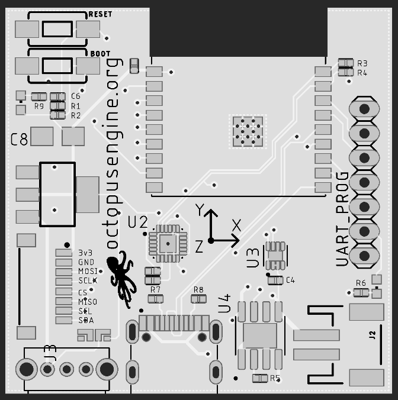

Catropy, originally proposed in the Proof-of-Cat [CatPaper](./proofofcat.pdf), is a small device dedicated to harvesting entropy from cats. 

## Design 

Heart of the device is a custom board which comes in a hand-made ball. Current design is a result of various iterations which improved effectivity and miniaturized the board. 

It consists of:

- ESP32 C3 microcontroller with wifi, Bluetooth
- Sensors for gathering data - gyroscope, accelerometer, thermometer
- 3 informational LEDs
- USBC for charging and programming the microcontroller 
- Charging circuit and external Lipo battery 500-800mAh 

The board is open-source and the hardware design with schematics can be found in [the respository](https://github.com/taxmeifyoucan/proof-of-cat/tree/master/pcb
). 


ESP microcontroller is flashed with MicroPython firmware and Catropy software which is written in Python. It serves a simple API over local network to provide the created randomness. Current version can be [found here](https://github.com/taxmeifyoucan/proof-of-cat/tree/master/esp). 

Entropy is collected from 6 values (3 axis from gyro and accelerometer), then further randomized using chaos formula and hashed together. Parts of created hashes are combined to create a big string which is tested for lenght in bits and Shannon entropy. When it passes certain values, random data can be read from the device by simple http call. 

## Usage 

Guide for setting up the device and pulling entropy. Initial setup needs to be done only once which requires connecting the board to your computer and configuring wifi. 

### Controlling the device 

Device can be controlled using standard tools for ESP microcontrollers. The easiest approach would be a GUI IDE [Thonny](https://thonny.org). It's supported on all major operating systems, you can download and install like any other program. 

Or if you prefer, install it using pip:
```
pip3 install thonny
```

If you would rather use a terminal instead of IDE, there are other command tools installable with pip which can be helpful:

- `esptool` (flashing firmware)
- `adafruit-ampy` (copying, executing files)
- `picocom` (terminal REPL prompt)

After installing Thonny or other tool you prefer, connect the board using its USBC to the computer and flip the switch to ON position. Green LED signalizes that device is running. When you open Thonny, you should see command prompt with details about the device and Micropython version. Some versions of the device might require having battery connected when connecting to PC. 

#### Connection troubleshooting 

If you get an error and shell doesn't pops up, there might be several issues. 

In case the device doesn't enable shell after connection or runs a program on startup, restart it using `Restart backend` button in Thonny and/or physically on the device using the `RESET` button on the top. 

If Thonny doesn't find the device at all, make sure it ON (green LED) and recongized. You can find the port used for communication with devices in `Tools > Options... > Interpreter (tab) > Port or WebREPL`. In case there is are no devices listed, make sure it is connected properly and other programs are not using it.

On Linux systems, make sure the user has correct rights to access the device. Check which board is the board connecting to and setup correct rights by adding your user to dialout group
```
sudo usermod -a -G dialout $USER
```
If the issue persists, the last resort would be to allow all users access to device, e.g.:
```
sudo chmod 666 /dev/ttyACM0  
```
If there are issues with connection or device restarting when wifi turns on, device might require having battery connected as additional power source. Use the battery which came with the device. 

### Enabling WiFi

Device connects to wifi and serves randomness data over a local network. To use the device for creating and pulling randomness, first you have to have connect it to a Wifi network. You can use your home network but for increased security, it is recommended to use a network without internet access, e.g. using mobile hotspot. Other possible ways of pulling entropy (Bluetooth, serial) are possible but currently not supported. 

To configure the device to connect to the wifi hotspot: 

Connect Catropy to your computer and start Thonny. You can browse files stored on the device by enabling `View > Files` or opening the file directly using `File > Open... > Micropython Device`. tHere you can see all files on the device and you can verify they match those in the repository. 

Open file `wifi.json` stored in `config` directory, `/config/wifi.json`. This is a configuration file which stores wifi networks, you can define multiple of them or just one. Change the json content to match your network:

```
{"networks": {"name_of_my_wifi": "wifi_password", "ssid2": "password2"}, "x": 2}
```

Make sure to save the changed file by `Save` button or `CTRL+S`. When you configured the wifi, you can run the main program to verify it connects correctly. 

Open the file `catro.py` which contains the main script. Run it from Thonny interface using green play button `Run the current script`. 

Output in the terminal is informing you about the current status. Device is starting, connecting to the wifi and if it succesfully connects, it prints the local IP address. It's important to save this IP address because it will be used to connect to the device later. 

If the connection was not succesful, it reports an error and status LED turns red. In this case, verify your wifi credentatials or consider using another wifi network. 

### Charging

Fully charging the battery can take up to 2 hours. The expected battery life can reach 8 hours but device will never let battery to fully discharge. Before turning the device on with battery power only, make sure it is charged enough. The yellow LED is on until the device is fully charged. 

### Informational LEDs

Device contains three LEDs which inform you about the device status without connecting it to computer. 
- 🟢 green LED, on the top
    - It shows the device is running, it should be always on when device is powered and switched ON
- 🟡 yellow LED, next to the battery connection 
    - It means that the connected battery is charging 
    - In latest version, this is changed to RGB led which is red while charging and green when fully charged 
- RGB led next to the switch is changing colors based on status of the entropy program
    - When you turn device on, during program startup, it blinks between green and red
    - 🟢 When it stays green, it means it succesfully connected to wifi and started collecting entropy 
    - 🔴 If it turns red, the wifi connection failed or another error occured 
    - 🔵 When initial entropy collection is done, the green turns to blue and signalizes that the device is ready to serve entropy

### Collecting entropy

If device has WiFi network configured and battery charged, you are ready to embrace the chaos! 

For the first run, test the device outside of the ball. Turn the device on using the switch and make sure the RGB led next to the switch stays green after initial red-green blinks. When it stays green, the is collecting entropy. 

Put the device to the ball with battery on the bottom of the board so it takes minimum space. The side with switch and USBC should be facing out so you can see the informational RGB led. 

That's it, just make sure it moves randomly :) Random data are now generated from its movement. It can take up to 5 minutes for the random data to reach neccessary size. When it happens, the LED turns blue. 

Now you can reach the device via API on the local address you saved during the initial setup. Input this address to your browser or call it using `curl`. The output is a long encoded entropy string. If the IP is not correct, it might changed during a reconnect and you can check it in your WiFi hotspot device, internet router interface. 

Calling the address directly will output the main random string. To check devices status, you can call `/status` path. 

Note that 5 minutes is a result of default speed for collecting entropy configured in the device but in case you would like to use it for a longer time, e.g. during the whole night because your cat is active during night, you can use this [fork of the code](https://github.com/pk910/proof-of-cat/tree/master/esp) which allow entropy collection for more than 10 hours.

### Contributing to the KZG Ceremony

With the intial entropy collection done and device succesfully responding with entropy, you are ready to use this entropy for KZG Ceremony contribution. 

To do this, you will need [Go KZG client](https://github.com/jsign/go-kzg-ceremony-client/). You can download it from the release page, verify its hash and extract it or compile using golang. 

First lets check it is available and connected to the sequencer by running: 
```
./kzgcli status

Lobby size: 4895
Number of contributions: 53699
Sequencer address: 0xfAA3A87713253D44E33C994556f7727AC71937f0
```

This client enables pulling data from http address with `--urlrand` flag and we will use it to get data from Catropy. 

First, create a session-id by logging with your Ethereum address or Github account on this link in your browser. 

Copy the session id from the response and past it to the rest of the command `/kzgcli contribute --urlrand <catropy_local_IP> --session-id <session-id>`

Here is an example of executing the command: 

```
/kzgcli contribute --urlrand http://192.168.213.63 --session-id 582e225b-bb3d-401b-ad71-c46bb8146c8b
Pulling entropy from http://192.168.213.63... Got it! (length: 5426)
Waiting for our turn to contribute...
Still isn't our turn, waiting 30s for retrying...
Waiting for our turn to contribute...
```

The client succesfully pulled the randomness string from Catropy. You can verify it was served by the device by calling the `/status` endpoint where the `lenght` parameter in bits should correspond to bit less than 4x the reported (one character has 4 bits minus formating symbols). 

Additional tips for contributing:

Don't forget to add `http://` prefix to the address passed to client because it needs to know what protocol to use. 

To make sure the entropy string is purged from the device, call the entropy endpoint again, restart the device using RESET button and flip the switch to fully erase device memory. 

With a big lobby of people trying to contribute, it can take days of waiting before the actual contribution to the sequencer. In case you cannot run it on background for such a long time, consider using a remote server. You can use `kzgcli` on a remote server, run it in `screen` or `tmux` and use ssh port redirection tunnel from your local computer to connect from remote server to Catropy. 
